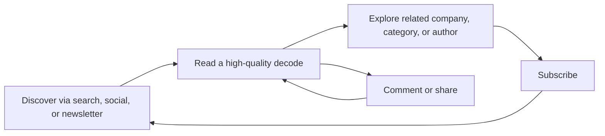
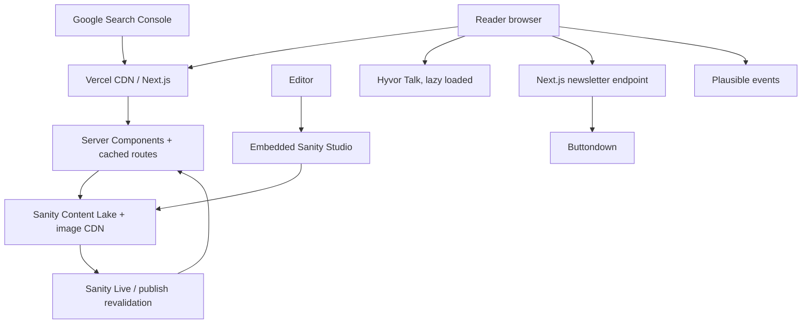

# Strategy Decode — Product and Technical Architecture

**Status:** build-ready MVP blueprint  
**Prepared:** 24 June 2026  
**Repository baseline:** Next.js 16.2.9, React 19.2, TypeScript, Tailwind CSS 4, App Router

## 0. Executive decision

Build Strategy Decode as a **content-first publication**, not a generic blog and not a platform.

The MVP stack should be:

| Layer | Choice | Why |
|---|---|---|
| Frontend | Next.js 16 App Router on Vercel | Excellent static delivery, image optimization, metadata, previews, and low operational work |
| CMS/content database | Sanity Content Lake + embedded Sanity Studio | Best balance of structured content, visual editing, flexible rich text, drafts, media, preview, and solo-developer speed |
| Styling | Tailwind CSS 4 + CSS custom properties | Already installed; fast to iterate while keeping a disciplined token system |
| Comments | Hyvor Talk | Hosted moderation, spam protection, privacy posture, data export, and no custom auth/database burden |
| Newsletter | Buttondown | Simple publishing, forms/API, archives, good deliverability, low starting cost, paid-newsletter path |
| Search | Sanity GROQ full-text search | No additional service at MVP scale; searches the required fields and supports ranked results |
| Analytics | Plausible + Google Search Console | Publisher-friendly, privacy-minded, lightweight product analytics plus authoritative search data |
| Error monitoring | Sentry free tier | Actionable production errors and source maps without building observability infrastructure |
| Application database | **None at launch** | Sanity owns content; Hyvor owns comments; Buttondown owns subscribers. A database before user accounts would be unused complexity |

### Decisions to challenge

1. **Do not build comments.** Moderation, spam, identity, notifications, abuse handling, and deletion requests are a product of their own.
2. **Do not add Postgres yet.** Add it when accounts, bookmarks, entitlements, or reading history become real requirements.
3. **Do not use Algolia yet.** GROQ search is enough for the first few thousand articles. A second index creates sync and operational work.
4. **Do not calculate “trending” from tiny traffic.** Curate it in the CMS at launch. Introduce a score only after the site has meaningful usage.
5. **Do not use one `featured: true` flag everywhere.** Homepage placement is an editorial decision and belongs in a curated homepage document.
6. **Do not index every tag page.** Thin taxonomy pages create crawl waste. Index a tag only when it has a description and enough articles.
7. **Do not force the entire reading experience to be black.** The brand shell can be dark; long-form reading needs a warm-light option as well as true dark mode.
8. **Do not add accounts for newsletter subscriptions or comments.** That is unrelated friction before premium content exists.

## 1. Product architecture

### Product promise

Strategy Decode helps ambitious operators understand **why companies win**, through deeply researched, highly readable business analysis.

### Primary audiences

| Audience | Job to be done | MVP experience |
|---|---|---|
| Founders/operators | Learn reusable strategic patterns | Deep articles, related reads, categories, newsletter |
| Investors/analysts | Understand business models and durable advantage | Company breakdowns, tags, search, citations |
| Students/early-career readers | Build commercial judgment | Clear explanations, reading time, approachable structure |
| Search/social visitors | Resolve one specific question | Fast landing page, strong headline/deck, excellent article body, clear next read |
| Editors/authors | Publish without developer help | Structured Studio, preview, drafts, portable rich content |

### Core content loop



### MVP success metrics

- Publishing: an editor can create, preview, and publish an article without a code deploy.
- Performance: p75 LCP under 2.5 s, INP under 200 ms, CLS under 0.1 on representative mobile traffic.
- Engagement: article completion proxy (75% scroll), related-article click-through, newsletter conversion.
- Acquisition: indexed article count, non-brand organic impressions, newsletter subscriber growth.
- Reliability: successful deploy rate, error-free sessions, no broken article/media links.

### Explicit non-goals for launch

Accounts, paywalls, premium articles, bookmarks, reading history, personalization, recommendations, forums, native apps, automated trending, a custom newsletter sender, and a custom comment system.

## 2. Technical architecture



### Rendering model

- Default to **React Server Components** for pages, article cards, navigation, Portable Text, metadata, and search results.
- Use Client Components only for theme switching, mobile navigation, reading progress, share/copy feedback, search-dialog interaction, newsletter form state, and the lazy comment embed.
- Use `generateStaticParams` for the newest/highest-value articles and allow other published slugs to render on demand.
- Use Sanity's current `next-sanity` Live Content integration for published updates and Draft Mode/visual editing. Keep metadata and URL queries free of visual-editing stega characters.
- Treat `params` and `searchParams` as promises, as required by this Next.js version.
- Use Next.js metadata files for `sitemap.ts`, `robots.ts`, icons, and generated social images.
- Use server-rendered Shiki output for code blocks. Do not ship a syntax-highlighting runtime to every reader.

### Cache and freshness policy

| Data/page | Strategy | Invalidation |
|---|---|---|
| Article | Cached published query and route output | Sanity Live or publish webhook/tag |
| Homepage | Cached curated document + article projections | Publish event; fallback max-age around 5 minutes |
| Category/author/tag | Cached archive query | Content publish affecting that taxonomy |
| Sitemap/RSS | Cached generated route | Publish event or short time revalidation |
| Search results | Dynamic by `q`, server rendered | CDN/private short cache only; never stale for long |
| Draft preview | Uncached, authenticated Draft Mode | Live updates |

Do not combine multiple caching models casually. Start with the official `next-sanity` Live Content path; only replace it with custom cache tags if real cost or freshness measurements justify it.

### Content request rule

Every query should return a projection containing only fields needed by that view. Cards never fetch article bodies. Article pages fetch the body, author data, resolved taxonomy, SEO, and related content in one bounded query.

## 3. Database and content schema

Sanity Content Lake is the MVP database. The model is relational in intent but represented as Sanity documents and references.

### `article`

| Field | Type | Rules / purpose |
|---|---|---|
| `_id` | Sanity ID | Stable ID; also use as Hyvor page ID |
| `title` | string | Required, recommended 35–80 characters |
| `slug` | slug | Required, unique, immutable after publication unless redirect added |
| `dek` | text | Required subheadline; approximately 100–220 characters |
| `excerpt` | text | Required card/search/SEO fallback; 140–180 characters |
| `body` | Portable Text array | Required; allowlisted editorial blocks only |
| `heroImage` | image + object | Image, alt text, caption, credit, focal point; alt required unless decorative |
| `authors` | reference[] → author | At least one; supports co-authorship |
| `primaryCategory` | reference → category | Exactly one |
| `secondaryCategories` | reference[] → category | Optional; no duplicate of primary |
| `tags` | reference[] → tag | Optional and controlled, not free-form keyword dumping |
| `companies` | reference[] → company | Optional; enables future company hubs |
| `publishedAt` | datetime | Required on publish |
| `updatedAtEditorial` | datetime | Only set for meaningful reader-visible updates |
| `status` | enum | `draft`, `inReview`, `ready`; published state still controlled by Sanity publish |
| `canonicalUrl` | URL | Only for syndicated/external-original content |
| `seo` | seo object | Optional title, description, share image, noindex |
| `relatedArticles` | reference[] → article | Optional manual override, max 4 |
| `sources` | source[] | URL, title, publisher, accessed date; supports credibility and later citations UI |
| `sponsorDisclosure` | object | Sponsor name and disclosure text; absent for normal editorial |

Derived at query/render time: reading minutes, word count, canonical URL, breadcrumb path, fallback related articles, share URLs. Do not store values that can be deterministically calculated unless query cost proves material.

### Portable Text blocks

- Standard: paragraph, H2, H3, H4, ordered/unordered lists, blockquote, strong, emphasis, underline, inline code, links.
- Custom: `imageBlock`, `pullQuote`, `youtubeEmbed`, `codeBlock`, `callout`, `table`, and `divider`.
- Link annotation supports external URL and internal references to article/category/author.
- External links receive safe `rel` behavior; sponsored links can be marked explicitly.
- Raw HTML and arbitrary scripts are forbidden.
- YouTube stores a validated video ID, title, and optional start time—not pasted embed HTML.
- Code stores code, supported language, optional filename, and highlighted-line ranges.

### `author`

`name`, unique `slug`, `role`, short `bio`, long `bio`, `portrait` with alt, `email` optional/private, social links object, `isStaff`, `seo`, and `active`.

The content author is separate from the Sanity login. This permits guest authors without giving CMS access.

### `category`

`title`, unique `slug`, `parent` reference (optional), materialized `fullPath`, `description`, `longDescription` (SEO/editorial content), `image`, `featuredArticle` optional, `seo`, and `order`.

MVP constraint: maximum depth of two. Validate against self-reference, cycles, duplicate sibling slugs, and duplicate full paths.

### `tag`

`title`, unique `slug`, `description`, optional `seo`, `indexable` (default false), and `aliases`. Tags are curated entities; writers select existing tags or deliberately create one.

### `company`

`name`, `slug`, `logo`, `summary`, `website`, `foundedYear`, `headquarters`, `industries`, and `seo`. Create now only if company-centric browsing is expected in the first editorial batch; otherwise add in phase two.

### `homePage` singleton

`heroEyebrow`, `heroHeadline`, `heroIntroduction`, `featuredStory`, ordered `categoryModules`, ordered `latestOverride` optional, ordered `trendingStories`, `newsletterHeading`, and `newsletterCopy`.

This document controls placement. “Latest” remains chronological unless an override is intentional.

### `siteSettings` singleton

Site title, tagline, description, base URL, logo assets, social profiles, default share image, navigation, footer groups, newsletter URLs, comment configuration flags, and organization schema data.

Secrets never belong in Sanity documents.

### `redirect`

`fromPath`, `toPath`, status (`301` or `308`), and note. Any published slug change must create a redirect before release.

### Future application database (not MVP)

When accounts/paywalls are approved, add managed Postgres (for example Neon/Supabase) through a repository interface. Initial tables:

```text
users(id, email, name, image_url, created_at, deleted_at)
accounts(id, user_id, provider, provider_account_id)
memberships(id, user_id, provider_customer_id, status, plan, period_end)
entitlements(id, user_id, key, source, starts_at, ends_at)
bookmarks(user_id, article_id, created_at) PK(user_id, article_id)
reading_events(id, user_id nullable, article_id, event_type, occurred_at)
comment_identities(user_id, hyvor_user_id)
```

Keep `article_id` as the stable Sanity document ID. Do not duplicate article content into Postgres.

## 4. CMS architecture

### Recommendation: Sanity

Sanity is the best fit because it combines a structured content model, a visual rich-text editor, draft/publish behavior, image handling, collaborative editing, customizable editorial inputs, typed Next.js queries, and click-to-edit preview. Its free plan currently includes live previews/visual editing and up to 20 seats, but only Admin and Viewer roles. Growth adds editorial roles, scheduled drafts, comments/tasks, and costs per seat.

The editor is not a pixel-for-pixel word processor. That is desirable: authors edit semantic content, while the frontend owns publication-quality typography. Sanity Visual Editing supplies the WYSIWYG-like page preview and click-to-edit workflow without storing brittle HTML.

### Why not the alternatives

| Option | Why not for this MVP |
|---|---|
| Payload | Excellent ownership and TypeScript model, but requires a database, auth, media storage, upgrades, and more operations |
| WordPress/headless WordPress | Familiar editor, but plugin/security/preview/API complexity is a poor trade for this clean greenfield build |
| Contentful | Solid product, but content modeling and plan constraints become expensive/awkward sooner for a solo publication |
| Storyblok | Strong visual editing, but Sanity's Portable Text customization and Next.js data workflow better fit bespoke long-form blocks |
| MDX in Git | Cheap and fast for a developer, but fails the visual-editor and multi-author editorial requirements |

### Studio layout

```text
Content
  Articles
    Drafts
    In review
    Ready to publish
    Published
  Authors
  Categories
  Tags
  Companies (phase 2)
Editorial curation
  Homepage
  Site settings
Operations
  Redirects
```

### Editorial workflow

1. Create article and assign author/category.
2. Draft with structured blocks and internal-link picker.
3. Run validation: title, slug, dek, excerpt, author, category, hero alt/credit, links, SEO preview.
4. Set `inReview`; review in Presentation/visual preview at desktop and mobile widths.
5. Set `ready`; publish manually in MVP.
6. Publishing updates the site without a frontend deployment.
7. Material corrections update `updatedAtEditorial` and optionally show a correction note.

Manual publishing is the honest MVP. Scheduled publishing requires Sanity Growth or a custom scheduler; do not build the latter to avoid one subscription.

## 5. Folder structure

Use a `src` directory during implementation and embed Studio in the same application for one repository and one deployment.

```text
src/
  app/
    (site)/
      layout.tsx
      page.tsx
      articles/
        page.tsx
        [slug]/
          page.tsx
          opengraph-image.tsx
      categories/
        page.tsx
        [...slug]/page.tsx
      authors/
        page.tsx
        [slug]/page.tsx
      tags/[slug]/page.tsx
      search/page.tsx
      newsletter/page.tsx
      about/page.tsx
    studio/[[...tool]]/page.tsx
    api/
      draft-mode/enable/route.ts
      draft-mode/disable/route.ts
      newsletter/subscribe/route.ts
    feed.xml/route.ts
    robots.ts
    sitemap.ts
    manifest.ts
    opengraph-image.tsx
    not-found.tsx
    global-error.tsx
    layout.tsx
    globals.css
  components/
    article/
    cards/
    comments/
    layout/
    newsletter/
    portable-text/
    search/
    seo/
    ui/
  sanity/
    schemaTypes/
      documents/
      objects/
      index.ts
    lib/
      client.ts
      live.ts
      image.ts
    queries/
    presentation/
      resolve.ts
    structure.ts
  lib/
    analytics/
    env.ts
    reading-time.ts
    seo.ts
    urls.ts
    validation.ts
  styles/
    prose.css
    tokens.css
  types/
sanity.config.ts
sanity.cli.ts
```

Boundaries:

- `app` composes routes; it does not contain general-purpose data logic.
- `sanity/queries` is the only place for production GROQ strings.
- `components/ui` contains primitives, not page-specific organisms.
- Portable Text renderers are centralized so article body behavior is consistent.
- Environment variables are parsed once in `lib/env.ts` and fail fast on the server.

## 6. Routing structure

| URL | Purpose | Indexing |
|---|---|---|
| `/` | Curated homepage | Index |
| `/articles` | Chronological archive with pagination | Index |
| `/articles/[slug]` | Canonical article | Index unless explicitly excluded |
| `/categories` | Category directory | Index |
| `/categories/[...slug]` | Parent/nested category archive | Index when substantive |
| `/authors` | Author directory | Index |
| `/authors/[slug]` | Author profile/archive | Index for active authors |
| `/tags/[slug]` | Tag archive | Noindex until quality threshold met |
| `/search?q=` | Search | Noindex, follow; canonical `/search` |
| `/newsletter` | Newsletter proposition + archive link/list | Index |
| `/about`, `/privacy`, `/terms`, `/editorial-policy` | Trust/legal | Index as appropriate |
| `/studio/*` | CMS | Noindex and Sanity-authenticated |
| `/feed.xml` | RSS | Feed |

Use query-string pagination (`?page=2`) initially, with self-canonicals only where archive pages have real discovery value. Never use a catch-all article route at the root; explicit `/articles/` avoids future collisions.

## 7. Component architecture

### Server components by default

`SiteHeader`, `SiteFooter`, `HeroEditorial`, `FeaturedStory`, `SectionHeader`, `ArticleCard` variants, `ArticleHeader`, `ArticleBody`, `AuthorByline`, `AuthorBio`, `Breadcrumbs`, `RelatedArticles`, `CategoryHeader`, `ArchiveGrid`, `NewsletterCTA` shell, and all structured-data components.

### Client islands

| Component | Why client-side | Guardrail |
|---|---|---|
| `ThemeToggle` | browser preference/local storage | Tiny; no theme-library dependency required |
| `MobileNav` | open/close/focus management | Lock scroll, Escape closes, focus returns |
| `ReadingProgress` | scroll position | `requestAnimationFrame`, passive listeners, reduced-motion aware |
| `SearchDialog` | keyboard dialog and debounced input | Results still available on server-rendered `/search` |
| `ShareActions` | Web Share/clipboard feedback | Native share first |
| `NewsletterForm` | pending/success/error state | Server endpoint owns secrets and validation |
| `Comments` | third-party embed | Lazy load near viewport or on “Join discussion” action |

### Card variants

Use one data contract with explicit visual variants: `lead`, `feature`, `standard`, `compact`, and `ranked`. Do not create unrelated card implementations that drift typographically.

## 8. Design system

### Design principles

1. Editorial hierarchy before decoration.
2. One commanding idea per viewport.
3. Rules, rhythm, and typography replace rounded containers.
4. Photography/illustration carries emotion; UI stays quiet.
5. Motion clarifies state and hierarchy; it never performs for attention.

### Color tokens

| Token | Dark | Warm light | Use |
|---|---:|---:|---|
| `canvas` | `#0A0A0A` | `#F5F1E8` | Page background |
| `surface` | `#121212` | `#FFFCF5` | Raised editorial area |
| `text` | `#FAFAFA` | `#171717` | Primary text |
| `muted` | `#9CA3AF` | `#636363` | Secondary text |
| `rule` | `#2A2A2A` | `#D8D1C4` | Borders/dividers |
| `accent` | `#EAB308` | `#A16207` | Labels, active state, restrained highlights |

The user-selected theme is stored locally; first visit follows system preference. Use the dark palette for the flagship homepage art direction. Long article text must remain available in warm light for comfort.

### Typography

- Display/editorial serif: **Newsreader** variable (or Source Serif 4 if testing renders better).
- UI/body sans: **Inter** or existing Geist Sans.
- Code: Geist Mono.
- Self-host/subset through `next/font`; use at most two variable font files plus mono only on code-containing pages if practical.
- Display scale: clamp roughly 3.5rem–8rem; body prose 18–21 px with 1.65–1.8 line height; measure 65–72 characters.

### Layout and geometry

- Content max width: 1440 px; main grid: 12 columns desktop, 6 tablet, 4 mobile.
- Prose max width: around 720 px; breakout media up to 1100–1200 px.
- Spacing follows a 4 px base with editorial jumps (8, 12, 16, 24, 32, 48, 64, 96, 144).
- Prefer square or subtly rounded corners (0–8 px). Avoid pill buttons except tags/filters where shape communicates compact selection.
- Use 1 px rules and whitespace instead of shadow-heavy cards.

### Motion and accessibility

- 120–220 ms state transitions; 300–450 ms editorial reveal only when it adds orientation.
- Respect `prefers-reduced-motion` and disable progress animation/reveals.
- Visible accent-colored focus ring, 44 px minimum touch targets, semantic landmarks, skip link, keyboard-operable dialogs.
- Contrast must meet WCAG AA; the accent is not used as small body text on a light background without the darker light-theme value.

## 9. Homepage wireframe

```text
┌──────────────────────────────────────────────────────────────┐
│ STRATEGY DECODE       Articles Categories Authors   Search ◐ │
├──────────────────────────────────────────────────────────────┤
│ STRATEGY / COMPANIES / POWER                                 │
│                                                              │
│ HOW THE WORLD'S MOST SUCCESSFUL                              │
│ COMPANIES ACTUALLY WIN.                                     │
│                                                              │
│ Deep reporting and analysis on the choices behind advantage.│
├──────────────────────────────────────────────────────────────┤
│ COVER STORY                                                  │
│ ┌───────────────────────────────┬──────────────────────────┐ │
│ │                               │ Category · 18 min       │ │
│ │      LARGE EDITORIAL IMAGE    │ The article headline... │ │
│ │                               │ Dek and author           │ │
│ └───────────────────────────────┴──────────────────────────┘ │
├──────────────────────────────────────────────────────────────┤
│ EXPLORE THE DECODES                                          │
│ Business Models | Growth | Marketing | Leadership | Investing│
├──────────────────────────────────────────────────────────────┤
│ LATEST DECODES                                               │
│ [large card]                 [card] [card]                    │
│ [card] [card]               [wide card]                      │
├──────────────────────────────────────────────────────────────┤
│ TRENDING NOW                01 Story                          │
│ Editor-curated              02 Story                          │
│                              03 Story                          │
├──────────────────────────────────────────────────────────────┤
│ ONE GREAT STRATEGY, DECODED EACH WEEK.   [email] [Subscribe]│
├──────────────────────────────────────────────────────────────┤
│ Brand thesis | Sections | Editorial | Legal | Social         │
└──────────────────────────────────────────────────────────────┘
```

On mobile, preserve editorial ordering: hero, cover image, cover text, category horizontal scroll, latest, ranked trending, newsletter. Avoid carousel-only content.

## 10. Article page wireframe

```text
┌──────────────────────────────────────────────────────────────┐
│ Header                                                       │
├──────────────────────────────────────────────────────────────┤
│ BUSINESS MODELS                                              │
│ A large, specific, multi-line article headline               │
│ The deck explains the tension and the reader payoff.         │
│ By Author · Jun 24, 2026 · 18 min read · Updated ...         │
├──────────────────────────────────────────────────────────────┤
│                 FULL-BLEED HERO IMAGE                        │
│                 Caption · Credit                             │
├───────────────┬───────────────────────────────┬──────────────┤
│ Share /       │ Article prose                  │ On this page │
│ progress      │ intro, headings, images,       │ (long pieces)│
│ (desktop)     │ pull quote, video, code        │              │
│               │                                │              │
│               │ [newsletter interruption only │              │
│               │  after meaningful reading]     │              │
├───────────────┴───────────────────────────────┴──────────────┤
│ Sources / correction note                                    │
│ Author portrait + bio + links                                │
│ Related decodes (3)                                          │
│ Newsletter CTA                                               │
│ Join the discussion (lazy-loaded comments)                   │
└──────────────────────────────────────────────────────────────┘
```

The table of contents appears only for sufficiently long, well-structured articles. Share buttons never become a floating mobile obstruction.

## 11. Author page wireframe

```text
┌──────────────────────────────────────────────────────────────┐
│ Header                                                       │
├──────────────────────────────────────────────────────────────┤
│ [Portrait]  AUTHOR                                           │
│             Name                                             │
│             Role                                             │
│             Bio across a comfortable measure                 │
│             Website · LinkedIn · X                           │
├──────────────────────────────────────────────────────────────┤
│ LATEST FROM NAME                            N ARTICLES        │
│ [lead article] [article] [article]                            │
│ [article]      [article] [article]                            │
│                  Pagination                                  │
└──────────────────────────────────────────────────────────────┘
```

## 12. Category page wireframe

```text
┌──────────────────────────────────────────────────────────────┐
│ Home / Categories / Growth                                   │
│ GROWTH STRATEGY                                              │
│ A useful editorial description, not SEO filler.              │
├──────────────────────────────────────────────────────────────┤
│ FEATURED IN GROWTH [large image] [headline, dek, author]      │
├──────────────────────────────────────────────────────────────┤
│ LATEST                                                       │
│ [article grid/archive with server pagination]                │
├──────────────────────────────────────────────────────────────┤
│ ABOUT GROWTH STRATEGY                                        │
│ Curated long description with links to key subcategories.    │
└──────────────────────────────────────────────────────────────┘
```

## 13. Search architecture

### MVP query path

1. `/search?q=...` receives a normalized query with a minimum length of two characters and a strict maximum.
2. The server queries only published articles.
3. GROQ ranks boosted title matches highest, then excerpt, category/tag names, then dek. Body search is intentionally excluded from the first pass to reduce noisy matches; add it only if readers need it.
4. Return title, slug, excerpt, hero thumbnail, date, reading time inputs, authors, category, and score.
5. Render real links in server HTML. The dialog can progressively enhance autocomplete, but search remains usable without JavaScript.

### Controls

- Debounce autocomplete 250–350 ms and require two characters.
- Parameterize GROQ; never interpolate user input into query strings.
- Cap autocomplete at 6–8 and full results at 20 per page.
- Rate-limit abusive request patterns at the platform layer.
- Log only aggregated search terms if the privacy policy permits it; never attach them to a durable reader identity.
- Track `search`, `search_no_results`, and `search_result_click` as aggregate events.

### Upgrade trigger

Move to Algolia/Typesense/Meilisearch only when one of these becomes true: tens of thousands of documents, typo tolerance is measurably important, complex facets are required, or GROQ latency/search quality misses the target. Use Sanity webhooks to maintain the external index then.

## 14. SEO architecture

### Per-page metadata

- Root `metadataBase`, title template, description, application name, publisher, and default social image.
- `generateMetadata` for article/category/author/tag data, using clean published queries with stega disabled.
- Absolute canonical for every indexable page.
- Open Graph type `article` for articles, with published/modified time, author URLs, section, and images.
- Twitter large-image card.
- Noindex for Studio, draft previews, search results, thin tags, internal utility routes, and error states.

### Structured data

| Page | Schema |
|---|---|
| Site-wide | `Organization` and `WebSite` |
| Article | `Article`; use `NewsArticle` only for genuinely timely journalism |
| Author | `Person` |
| Category/tag/archive | `CollectionPage` |
| Nested paths | `BreadcrumbList` |

Article schema includes headline, description, image, author, publisher/logo, `datePublished`, honest `dateModified`, main entity URL, and article section. Serialize JSON-LD safely by escaping `<` to prevent injected closing tags.

### Technical SEO

- Dynamic `sitemap.ts` includes published articles, substantive categories/tags, and authors; `lastModified` reflects real content updates.
- Split sitemaps only after URL volume justifies it.
- `robots.ts` allows public pages and disallows Studio/API/internal preview paths; robots is not access control.
- Generate RSS at `/feed.xml` with canonical article URLs.
- Redirect old slugs permanently; avoid redirect chains.
- Image assets have descriptive alt text, explicit dimensions/aspect ratio, and stable CDN URLs.
- Breadcrumbs are visible UI, not schema-only decoration.
- Submit sitemap and domain property to Search Console; validate rich results and monitor Page Indexing/CWV reports.

### Editorial SEO guardrails

- One search intent and one original thesis per article.
- No keyword field disguised as strategy. Tags serve readers first.
- Category descriptions are editorially useful and link to cornerstone work.
- Index a tag only after it has a unique description and roughly five strong articles.
- Do not update `dateModified` for layout changes or automated rebuilds.

## 15. Analytics architecture

### Launch stack

- **Plausible Starter** for pageviews, sources, devices, countries, automatic scroll depth, and privacy-friendly aggregate events.
- **Google Search Console** for queries, impressions, rankings, indexing, sitemap, and Core Web Vitals.
- **Vercel runtime/build logs** for operational health; add Sentry for exceptions.
- Cloudflare Web Analytics is the free fallback if the extra analytics subscription blocks launch, but Plausible has the more useful publisher workflow.

### Event dictionary

| Event | Properties (low-cardinality only) |
|---|---|
| `newsletter_subscribe` | placement, success |
| `article_read_50` / `article_read_75` | article ID, category |
| `related_article_click` | source article ID, destination article ID |
| `search` | has_results, result_count bucket |
| `search_result_click` | rank bucket |
| `share` | method |
| `comment_section_open` | article ID |

Do not collect article scroll checkpoints on every percent or send free-form personal data. Define one canonical naming document and test events in preview before launch.

### Trending evolution

- MVP: ordered references in the homepage singleton, reviewed weekly.
- Later: daily job calculates a decayed score such as `views_7d + 3*comments_7d + 4*newsletter_clicks_7d`, excludes the newest 24 hours if sample size is poor, and writes suggestions for editorial approval—not automatic homepage control.

## 16. Newsletter architecture

### MVP

- Buttondown owns subscriber records, unsubscribe state, deliverability, sends, and hosted archives.
- Strategy Decode owns the branded `/newsletter` landing page and forms.
- Forms post to a same-origin Next.js route, which validates email/consent, uses a honeypot and rate limiting, calls Buttondown with a server-only key, and returns generic safe errors.
- Capture `source` as a controlled tag/metadata value (`header`, `article_inline`, `article_end`, `footer`, `newsletter_page`).
- Use confirmed opt-in where legally or reputationally appropriate.
- Link the hosted Buttondown archive at launch. If issues mirror articles, configure canonical URLs back to Strategy Decode to avoid duplication.

Buttondown currently starts free for the first 100 active subscribers and includes hosted archives; advanced features are add-ons. Do not pay for a custom archive subdomain at launch unless the hosted URL materially harms conversion.

### Future

- Sync content via Buttondown RSS-to-email or API only after the editorial email format stabilizes.
- Add a `newsletterIssue` Sanity document if the on-site archive needs bespoke issue pages.
- Keep subscriber ownership portable with regular exports.
- Paid newsletter can use Buttondown/Stripe initially; full-site premium access later moves entitlements into the application database while Buttondown remains a delivery channel.

## 17. Deployment architecture

### Environments

| Environment | Frontend | Sanity dataset | Purpose |
|---|---|---|---|
| Local | localhost | development or production read + drafts | Build/test |
| Preview | Vercel preview URL | development/production drafts via authenticated preview | Review every PR |
| Production | `strategydecode.com` | production | Readers |

One Sanity production dataset is enough initially if preview access is disciplined. Add a development dataset before schema migrations become risky.

### Delivery flow

1. Feature branch and pull request.
2. Vercel preview build; run lint, type check, tests, and Lighthouse smoke checks.
3. Validate schema/preview against Sanity.
4. Merge to main for production deploy.
5. Content publishing updates cached pages independently of code deployment.

### Hosting decision

Use Vercel Pro for the commercial publication. It is currently a $20/month platform fee for one deploying seat with included usage credit. Set spend alerts immediately. Keep the deployment portable by avoiding Vercel-only storage until it solves a demonstrated problem.

### Media

Sanity image CDN is the original media store. Use the Next.js image component with approved remote patterns, responsive `sizes`, focal-point crops, and quality appropriate to editorial imagery. Never upload giant decorative video to the application bundle.

## 18. Security and privacy

- Parse and validate all environment variables; keep Sanity write/read tokens and Buttondown keys server-only.
- Use a read-only Sanity Viewer token for Draft Mode; never expose a write token.
- Validate Draft Mode handshakes and disable routes; previews must be `noindex`.
- Render Portable Text through an allowlist. No raw HTML/script block in the CMS.
- Sanitize/escape JSON-LD and validate external URLs/protocols.
- Add CSP incrementally, accounting for Sanity image CDN, Plausible, Hyvor, and privacy-enhanced YouTube. Prefer nonces/hashes over broad `unsafe-inline`.
- Add HSTS, `X-Content-Type-Options`, strict referrer policy, permissions policy, and frame restrictions except where Sanity Presentation requires explicit origins.
- Newsletter endpoint: schema validation, honeypot, IP-based rate limits with privacy-conscious retention, same-origin checks where useful, generic errors.
- Use `youtube-nocookie.com`, poster-image facades, and click-to-load embeds where possible.
- Publish privacy, terms, cookie/tracking, corrections, and editorial/sponsorship policies.
- Enable MFA on Vercel, Sanity, domain registrar, GitHub, newsletter, analytics, and comment accounts.
- Dependabot/Renovate weekly; test framework/CMS upgrades in preview.
- Daily/weekly exports for critical editorial content and subscriber lists; document restore procedures.
- Define comment moderation rules, escalation, deletion/export handling, and an email for abuse reports.

## 19. Performance plan

### Budgets

- Initial route JavaScript: target under 100 KB compressed for article pages, excluding a comment embed that has not loaded.
- LCP hero: correct responsive size, priority only for actual above-fold image, target under ~200 KB on common mobile viewport where art allows.
- Fonts: two variable families maximum in initial shell; subset and preload only what is used.
- CLS: reserve media/ad/embed dimensions; target under 0.1.
- Third parties: Plausible early/deferred as appropriate; comments and YouTube load after interaction or near viewport.

### Implementation rules

- Prefer static/cached server output and HTML links.
- Avoid global client providers unless unavoidable.
- Never hydrate the Portable Text article body.
- Use pagination instead of unbounded infinite scroll; it is more accessible and crawlable.
- Use image aspect-ratio contracts in schemas/cards.
- Run bundle analysis before launch and when adding a major dependency.
- Test with mid-tier Android/mobile throttling, not only a founder's laptop.

## 20. Cost estimates (June 2026 list-price planning)

### Recommended launch

| Service | Estimated monthly | Notes |
|---|---:|---|
| Vercel Pro | $20 | Commercial hosting, one deploying seat; overages possible |
| Sanity Free | $0 | Sufficient for solo MVP; public datasets and limited roles |
| Hyvor Talk Personal | about €5 | Annual billing; 1 site/1 moderator/credit allowance |
| Buttondown | $0 initially | First 100 active subscribers; cost grows with list/add-ons |
| Plausible Starter | $9 | Up to 10k monthly pageviews at current listed tier |
| Sentry | $0 | Start on free tier |
| Domain | about $1–2 amortized | Registrar/TLD dependent |
| **Expected launch total** | **about $35/month + tax** | Before traffic or subscriber overages |

### Ultra-lean alternative

Replace Plausible with free Cloudflare Web Analytics and use Hyvor's annual personal plan. Approximate recurring stack becomes **$25/month plus domain/tax**. Do not use Vercel Hobby for a commercial publication merely to make the spreadsheet prettier.

### Likely growth costs

- Sanity Growth: $15/seat/month when real contributors need Editor/Contributor roles or scheduled drafts.
- Hyvor Premium: €12/month when multiple moderators/monthly billing or more capacity is needed.
- Newsletter: variable by active subscriber count and selected add-ons.
- Vercel usage: monitor image transformations and bandwidth; use spend controls.
- Plausible: plan increases with monthly pageviews.

Recheck prices at purchase time. Pricing changes; architecture should not depend on a promotional allowance.

## 21. Development roadmap

### Phase A — foundation (2–3 days)

- Remove starter content and normalize the existing Tailwind/CSS variable mismatch.
- Establish tokens, typography, grid, container, focus states, theme behavior.
- Configure Sanity, schemas, type generation, Studio structure, environment validation.
- Create core fixtures for at least 8 representative articles and all custom body blocks.

### Phase B — content system (3–5 days)

- Implement typed GROQ projections and Portable Text renderer.
- Add images, captions/credits, internal links, YouTube facade, code block highlighting, pull quotes.
- Add Draft Mode, Presentation/visual editing, validation, and published content refresh.

### Phase C — publication surfaces (5–7 days)

- Build shared shell, homepage, article page, archives, category, author, tag, not-found/error states.
- Add breadcrumbs, related content, reading time/progress, share actions, theme toggle.
- Complete mobile layouts and accessibility pass as each surface lands.

### Phase D — discovery and growth (3–4 days)

- Implement server-rendered search and search dialog enhancement.
- Add Buttondown form/API integration and newsletter page/archive link.
- Add Hyvor comments lazily.
- Add RSS, sitemap, robots, metadata, JSON-LD, social images, redirects.

### Phase E — launch hardening (3–4 days)

- Plausible event QA, Search Console setup, Sentry, security headers, rate limits.
- Lighthouse/Web Vitals testing on production-like content and devices.
- Broken-link, metadata, schema, keyboard, screen reader, and contrast checks.
- Backup/export drill, moderation workflow, editorial checklist, legal/trust pages.

Reasonable solo implementation: **3–5 focused weeks**, assuming article content/assets are ready and design revisions stay inside this system.

## 22. MVP launch roadmap

### Must have before launch

- Homepage with intentional real curation.
- Article, article archive, category, author, and search pages.
- At least 8–12 high-quality articles across 3–5 meaningful categories.
- Rich body blocks, images, YouTube, code, pull quotes, sources, related articles.
- CMS drafts, preview, validation, manual publish workflow, multiple author profiles.
- Newsletter capture and public archive destination.
- Moderated comments.
- Metadata, canonicals, schema, sitemap, robots, RSS, redirects, 404.
- Mobile/accessibility/performance QA, analytics, Search Console, error monitoring.
- Privacy, terms, editorial policy, corrections policy, sponsor disclosure policy.

### May follow in the first 30 days

- Company hub documents/pages.
- Better search weighting and suggestions based on real queries.
- Automated weekly performance report.
- Newsletter issue pages in Sanity if hosted archives feel disconnected.
- Table of contents and footnotes if long-form content proves the need.

### Launch gate

Do not launch with empty categories, placeholder author profiles, fake trending numbers, or a beautiful shell containing one article. A publication's credibility is inventory plus editorial consistency.

## 23. Future roadmap and scaling plan

### Stage 1 — prove the publication (0–50k monthly pageviews)

- Keep current architecture.
- Curate homepage/trending manually.
- Improve templates from observed reading and conversion behavior.
- Build editorial cadence and taxonomy discipline before more software.

### Stage 2 — improve discovery and revenue (50k–250k)

- Add company/industry hub pages and curated topic guides.
- Add sponsorship placements as explicit CMS modules with disclosure, dates, and reporting IDs.
- Introduce analytics-assisted trending suggestions.
- Evaluate external search only against measured GROQ limitations.
- Add a lightweight ad-slot component behind consent/performance controls; avoid layout shift.

### Stage 3 — membership (validated willingness to pay)

- Add Auth.js or a managed auth provider, managed Postgres, Stripe Billing, and entitlement checks.
- Model access level on articles (`public`, `metered`, `premium`) but do not expose premium body content in public query responses or HTML.
- Use server-side authorization for every protected read; middleware alone is not security.
- Add bookmarks and reading history as separate features behind a repository/service layer.
- Connect Hyvor SSO only after Strategy Decode accounts exist.

### Stage 4 — intelligence and community

- Recommendations begin with explainable category/tag/company similarity plus behavior for consented users.
- AI summaries are generated on publish, editor-reviewed, versioned, and clearly labeled; never generated on every page request.
- Forums/community should be a separate bounded product or mature vendor integration, not an expanded comment table.
- Mobile app consumes a stable content API/BFF only after retention proves mobile-specific value.

### Scale triggers, not guesses

| Trigger | Response |
|---|---|
| Search p95 too slow or relevance poor | Add dedicated index with webhook sync |
| Build/publish fan-out costly | Use granular content tags and webhook invalidation |
| Sanity query/CDN usage expensive | Tighten projections/cache; negotiate/upgrade based on evidence |
| Image bill grows sharply | Audit transformations, cache variants, formats, source dimensions |
| Editorial team >2–3 active people | Upgrade CMS roles/workflow and formalize review permissions |
| Premium validated | Add auth/Postgres/Stripe in a separate application domain layer |
| Multi-region personalized reads | Revisit data locality and edge strategy then—not before |

## 24. Build acceptance criteria

The architecture is successfully implemented when:

- An editor can create every supported article block, preview it, and publish without engineering help.
- Publishing updates the appropriate public pages without a full site deploy.
- Every public template works with keyboard, mobile, dark/warm-light themes, long titles, missing optional fields, and realistic images.
- Search finds title, excerpt/dek, tags, and categories and remains usable without client JavaScript.
- Article HTML contains canonical metadata, Article JSON-LD, visible breadcrumbs, semantic headings, and stable media dimensions.
- Comments do not delay the article LCP and can be moderated/exported.
- Newsletter signup handles success, duplicates, validation errors, provider failure, bots, and accessibility states.
- Lighthouse lab tests are strong and production field vitals are observable.
- There is no application database, authentication system, recommendation engine, or paywall hiding in the MVP “foundation.”

## 25. Sources used for time-sensitive decisions

- [Sanity pricing](https://www.sanity.io/pricing)
- [Sanity visual editing with Next.js App Router](https://www.sanity.io/docs/nextjs/visual-editing-with-next-js-app-router)
- [Sanity GROQ text search](https://www.sanity.io/docs/content-lake/search-content-with-groq)
- [Hyvor Talk pricing](https://talk.hyvor.com/pricing)
- [Buttondown pricing](https://buttondown.com/pricing)
- [Buttondown web archives](https://buttondown.com/features/archives)
- [Plausible pricing and product](https://plausible.io/)
- [Cloudflare Web Analytics](https://www.cloudflare.com/web-analytics/)
- [Vercel Pro plan](https://vercel.com/docs/plans/pro)

Next.js implementation choices were checked against the versioned documentation installed in `node_modules/next/dist/docs/`, especially App Router project structure, data fetching, caching/revalidation, Draft Mode, metadata, JSON-LD, sitemap, and robots conventions.
